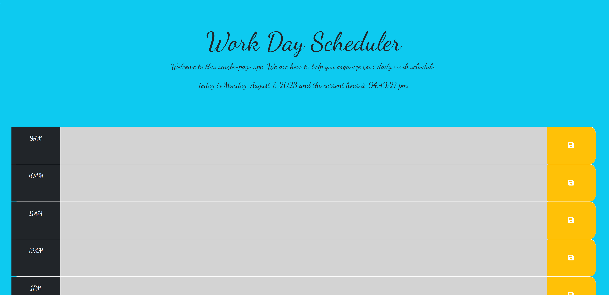
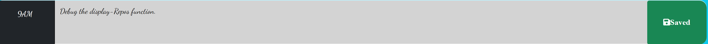

# Work Day Appp

We present a simple single-page Web App that we hope will be helpful to all sorts of workers that follow the traditional officespace 9am to 5pm grind. Its UI was designed with two things in mind: 

    1. Look as good as possible without being too distracting.

    2. Be as intuitive and easy to use as possible.

The App was created through judicious use of the JQUERY library as a dependency, the Day.js utility library in order to get and format time and dates, and third-party APIs such as Google Fonts, the icon library Font Awesome, and the CSS framework Bootstrap.

## Usage

The application is currently deployed in GitHub pages at the following URL: https://jguemarez.github.io/WorkDayApp/.

When the page loads, the user will be greeted with the following screen message:

You can see the present date and hour and there are some time blocks with text areas labeled with each of the working hours from 9am to 5pm.

By clicking on the text-area the user is allowed to enter the planned activities/tasks for the given hour.

By clicking on the button found to the right of the text area, the user input will be saved in permanent client-side storage so that it is not erased when refreshing the page or after closing the tab.

## Authorship

This Web App is of the authorship of Jonathan Maldonado Guemarez. The public repo can be found at :
https://github.com/jguemarez/WorkDayApp.git

The Normalize.css (used to do a CSS reset) was downloaded from: https://necolas.github.io/normalize.css/

The .gitignore file was taken from the BootCamp repo located at: https://git.bootcampcontent.com/

## Support

You can reach me concerning any doubts at: cantor.dedekind112358@gmail.com.

## Contributing

Any constructive criticism is welcome. Please open an issue to review before enacting any change to the code.

## License

This open-source project is licensed under the 
[MIT](https://choosealicense.com/licenses/mit/) license. Please click the link for more information.